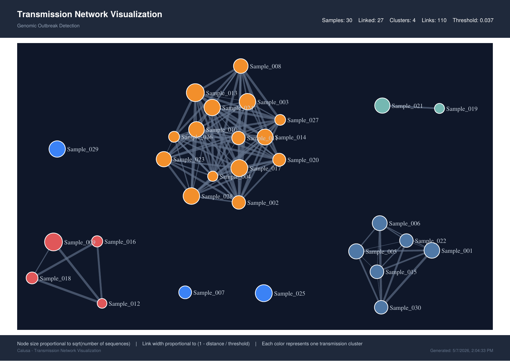

# Calusa

**Calusa** is an interactive tool for visualizing pathogen transmission networks from genomic sequence data. It computes pairwise Hamming distances from FASTA-formatted haplotype sequences, identifies transmission clusters, and renders a force-directed network graph in the browser using D3.js.

Named after [Calusa Beach](https://www.floridastateparks.org/BahiaHonda) on Bahia Honda Key, Florida — one of the most iconic beaches in the Florida Keys.

Developed for genomic surveillance of bloodborne and foodborne pathogens (HCV, HAV, HBV).

> **Try it now → [bphl-molecular.github.io/Calusa](https://bphl-molecular.github.io/Calusa/)** — open the link, drag in a JSON file, and explore. No installation, no server. All processing runs in your browser; nothing is uploaded.


*Sample GHOST surveillance dataset visualized in Calusa: 30 samples, 4 transmission clusters, 110 links. Node size scales with haplotype count; each color is a separate cluster. Try this exact view by uploading [`examples/ghost_network_sample.json`](examples/ghost_network_sample.json).*

---

## Overview

Calusa consists of two components:

**`calusa.py`** — A Python pipeline that reads multi-sequence FASTA files, calculates minimum pairwise Hamming distances between samples, identifies transmission clusters via depth-first search, and exports results as CSV and JSON.

**`calusa.html`** — A standalone, single-file HTML/JavaScript application that loads exported JSON and renders an interactive D3.js force-directed network graph with zoom, pan, cluster coloring, tooltips, label toggling, adjustable label size, and SVG/PDF export. The visualizer also accepts JSON output from CDC's [GHOST](https://www.cdc.gov/hepatitis-vrdl/php/ghost/index.html) system for HCV/HAV surveillance, so existing GHOST users can visualize their results directly.

## Features

- Pairwise Hamming distance calculation with ambiguous-base handling (only A/T/C/G positions scored)
- Configurable distance threshold (default 0.037 for HCV; set 0 for HAV-VPB)
- Transmission cluster identification using connected-component DFS
- Interactive D3.js force-directed graph with cluster-based coloring
- Node sizing scaled by haplotype sequence count
- Distance-weighted link styling (thicker = closer)
- Hover tooltips showing sample ID, cluster, sequence count, and link distances
- Zoom, pan, label toggle, adjustable label size, and SVG / PDF export
- PDF / SVG export automatically packs clusters tightly so the figure fits a printed page without shrinking the individual clusters
- Drop-in compatibility with JSON exported by CDC's GHOST system (HCV/HAV surveillance)
- Fully client-side visualization — no server required, nothing leaves the browser

## Requirements

**Python pipeline:**

- Python 3.8+ (3.11 recommended)
- pandas

Install with **conda** (recommended for reproducibility):

```bash
conda create -n calusa -c conda-forge python=3.11 pandas -y
conda activate calusa
```

Or with **pip**:

```bash
pip install pandas
```

**Visualization:**

- Any modern web browser (Chrome, Firefox, Edge, Safari — last two versions)
- D3.js v7, jsPDF, and svg2pdf.js are loaded automatically from public CDNs
- No installation needed if you use the [hosted version](https://bphl-molecular.github.io/Calusa/)

## Resource Requirements

**Python pipeline (`calusa.py`):**

- CPU: any modern processor; pairwise distance is computed in O(n²) time over sample pairs
- RAM: a few hundred MB for typical surveillance datasets (≤ 100 samples × few thousand bp); larger datasets (1000+ samples) may need 2 GB or more
- Disk: outputs are small — a few hundred KB to a few MB per run
- Runtime: seconds to a few minutes for routine datasets

**Browser visualization (`calusa.html`):**

- Any modern desktop or mobile browser
- ~4 GB system RAM is comfortable for networks with 500+ nodes; smaller graphs run on essentially anything
- All computation runs client-side — uploaded JSON files never leave your browser, even when using the hosted version

## Quick Start

**The fastest path:** if you already have a `network.json` (from `calusa.py`, GHOST, or any compatible source), open the [hosted version](https://bphl-molecular.github.io/Calusa/) and upload it — that's the entire workflow.

To generate your own JSON from FASTA sequences:

### 1. Generate Network Data

Process a FASTA file with the default HCV threshold (0.037):

```bash
python calusa.py --input sequences.fasta
```

Specify a custom threshold and output directory:

```bash
python calusa.py --input sequences.fasta --threshold 0.05 --output ./results
```

For HAV with a zero-distance threshold:

```bash
python calusa.py --input sequences.fasta --threshold 0 --output ./results
```

Create a sample FASTA file for testing:

```bash
python calusa.py --create-sample
```

### 2. Visualize the Network

1. Open `calusa.html` locally, **or** use the [hosted version](https://bphl-molecular.github.io/Calusa/).
2. Click **Upload JSON** and select the generated `network.json`.
3. Interact with the network: zoom, pan, hover for details, toggle labels, adjust label size, and export as SVG or PDF.

## Input Format

The pipeline expects a standard multi-sequence FASTA file. Each header should follow the pattern `>SampleID_seqN` where the trailing `_seqN` (or `_hapN`) segment identifies individual haplotype sequences within a sample. All sequences sharing the same sample ID prefix are grouped together.

```
>Sample_001_seq_1
ATCGATCGATCGATCGATCGATCGATCGATCGATCGATCG
>Sample_001_seq_2
ATCGATCGATCGAACGATCGATCGATCGATCGATCGATCG
>Sample_002_seq_1
ATCGATCGATCGATCGATCGATCGATCGATCGATCGATCG
>Sample_003_seq_1
GGCGATCGATCGATCGATCGATCGATCGATCGATCGATCG
```

## Examples

A ready-to-use sample file is included so you can see Calusa's full visualization in seconds:

```
examples/ghost_network_sample.json
```

This is a real GHOST surveillance dataset — 30 samples spanning 4 transmission clusters (cluster sizes 15 / 6 / 4 / 2) plus a few unlinked samples. To try it:

1. Open [bphl-molecular.github.io/Calusa](https://bphl-molecular.github.io/Calusa/)
2. Click **Upload JSON** and select `examples/ghost_network_sample.json`
3. Toggle **Show Labels**, drag nodes around, then try **Export PDF** — that's how the screenshot above was produced

### GHOST System Compatibility

If you are already running CDC's GHOST system for HCV/HAV surveillance, the visualizer accepts the GHOST `network.json` output directly — no conversion required. GHOST's `haplotypes` field is recognized as the equivalent of `num_sequences`, so node sizes still reflect within-host diversity. Simply open the [hosted Calusa](https://bphl-molecular.github.io/Calusa/) and upload your GHOST JSON.

## Output Files

The pipeline produces three output files:

| File | Description |
|------|-------------|
| `threshold_links.csv` | All sample pairs with minimum Hamming distance ≤ threshold, including cluster assignment |
| `cluster_summary.csv` | Per-sample summary with cluster ID and haplotype sequence count |
| `network.json` | JSON file for the D3.js visualization containing nodes, links, and metadata |

### JSON Schema

```json
{
  "metadata": {
    "threshold": 0.037,
    "total_samples": 100,
    "total_links": 250,
    "total_clusters": 8
  },
  "nodes": [
    { "id": "Sample_001", "num_sequences": 3, "cluster": 0 }
  ],
  "links": [
    { "source": "Sample_001", "target": "Sample_002", "distance": 0.012,
      "num_seqs_source": 3, "num_seqs_target": 2 }
  ]
}
```

## Distance Calculation

Hamming distance is computed as the proportion of differing nucleotides at valid (A/T/C/G) positions between two sequences. Gaps, N's, and other ambiguous bases are excluded from both the numerator and denominator. When comparing two samples with multiple haplotype sequences each, the **minimum** distance across all sequence pairs is used as the inter-sample distance.

## Command-Line Reference

```
usage: calusa.py [-h] [--input INPUT] [--threshold THRESHOLD]
                 [--output OUTPUT] [--create-sample]

optional arguments:
  -i, --input         Input FASTA file
  -t, --threshold     Transmission distance threshold (default: 0.037)
  -o, --output        Output directory (default: current directory)
  --create-sample     Create a sample FASTA file and exit
```

## Recommended Thresholds

| Pathogen | Threshold | Reference |
|----------|-----------|-----------|
| HCV      | 0.037     | Default   |
| HAV-VPB  | 0.000     | Exact match |

## License

This project is part of the BPHL-Molecular bioinformatics pipeline collection for public health genomic surveillance.
